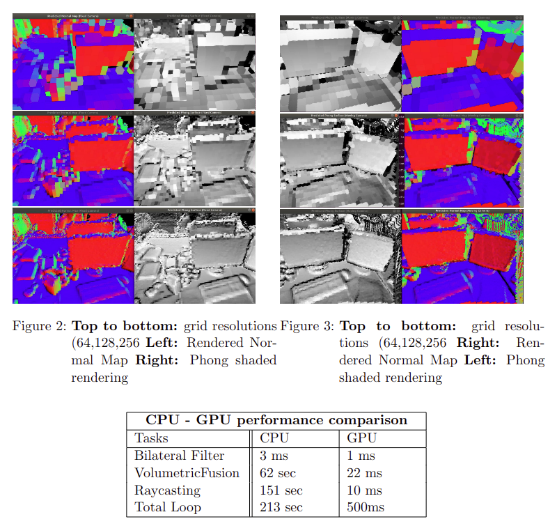

# KinectFusion

Make sure you have intsalled Cuda Toolkit corresponding to your Nvidia Driver version. E.g. My Nvidia Driver is 470 and Cuda Toolkit is 11.4. Also, install the CuDNN library alongside with toolkit. Check the website for installation guide, it is pretty clear.

Install opencv source from the Opencv (https://github.com/opencv/opencv) and Opencv-Contrib (https://github.com/opencv/opencv_contrib). Note that I installed Opencv 4.5.4

## File current file structure 

- Data
- preprocessing
- Libs
  - Eigen
  - Ceres
  - Flann
  - glog
  - opencv4.5 (arbitrary name) 
    - opencv-4.5.4
    - opencv-contrib-4.5.4
    - build

- main.cpp
- CMakeLists.txt

## For Opencv gpu CMake installation, make sure to do the following

PS. Even though opencv is installed, I can't plot anything. Internet forums suggest to install these libraries too. Install them and re-build opencv. But I haven't done it yet. So, you may want to download these beforehand. 
1. libgtk2.0-dev
2. pkg-config

So, in CMAKE: 

- WITH_GTK (also WITH_GTK2.0 ?)  (checked)
- WITH_CUDA (checked)
- OPENCV_DNN_CUDA (checked)
- BUILD_OPENCV_DNN (checked)
- ENABLE_FAST_MATH (checked)
- BUILD_OPENCV_WORLD (checked)
- OPENCV_EXTRA_MODULES_PATH  -> path to modules (../KinectFusion/Libs/opencv4.5/opencv-contrib-4.5.4/modules)

- cuda_fast_math  (checked)
- cuda_Arch_bin - 7.5 (which found yours here: https://en.wikipedia.org/wiki/CUDA)

#### NOTE: Add variable -DWITH_GTK=ON to cmake options! 
